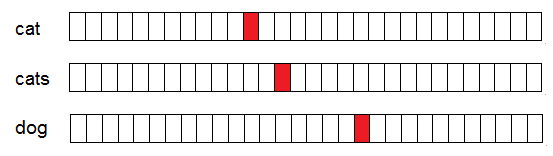
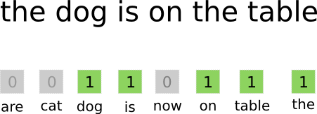
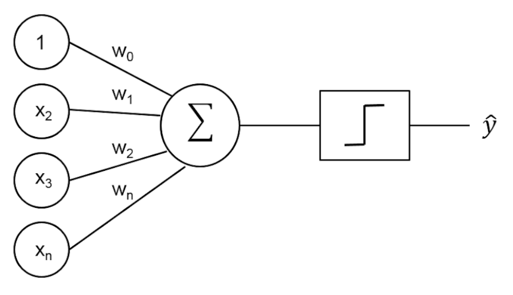

@title[Introduction]

# Introduction<br>to Keras

<br>

### PyCon Prague 2018

### Petr Baudis, Rossum

<br>

https://github.com/rossumai/pyvo17-imdb

---
@title[Basic Task]

### IMDb Reviews Sentiment

this is one amazing movie!!!!! i myself did not understand everything but knowing chinese folklore (i studied them in school)it is very complicated. you just have to take what it gives you.....ENJOY THE MOVIE AND ENJOY THE RIDE....HOORAY!!!!

I hope the makers of this crap have day jobs because this film sucked!!! It looks like someones home movie and I don't think more than $100 was spent making it!!! Total crap!!! Who let's this stuff be released?!?!?!

---
@title[Training Problem]

#### Goal: Predict sentiment from text input

We have labelled examples<br>(_dataset_ - _supervised_ training).

Labels are **yes**/**no** - _categorical_.

**Machine Learning Model:** Propose a mathematical formula that computes the sentiment from input.

**Machine Learning Training:** Find coefficients in the mathematical formula automatically.

How to encode text input mathematically?

---
@title[Bag-of-Words Representation]

#### Can we guess the sentiment<br>based on isolated words?

<br>

this is one **amazing** movie!!!!! i myself did not understand everything but knowing chinese folklore it is very _complicated_.

I _hope_ the makers of this **crap** have day jobs because this film **sucked**!!!

<br>

_"Bag-of-words" Representation_

---
@title[One-hot Encoding]

#### How to represent words mathematically?

**One-hot encoding:** An array as big as the dictionary,<br> all zeroes except a single 1 at the index of the word.



---
@title[One-hot Encoding]

#### How to represent words mathematically?

**One-hot encoding:** An array as big as the dictionary,<br> all zeroes except a single 1 at the index of the word.



---
@title[One-hot Encoding]

#### How to represent words mathematically?

**One-hot encoding:** An array as big as the dictionary,<br> all zeroes except a single 1 at the index of the word.

```
[1,     1,          0,   0,   0]
amazing complicated hope crap sucked
```

---
@title[One-hot Encoding]

#### How to mathematically determine sentiment?

```
[1,     1,          0,   0,   0]
amazing complicated hope crap sucked
```

Multiply each element by the _word weight_ (positive or negative), sum them up.

`[?,     ?,          ?,   ?,   ?]`



---
@title[Text to Words]

#### Ok, let's code it!

The first problem in Natural Language Processing: **Tokenization**

this is one amazing movie!!!!! i myself did not understand everything but knowing chinese folklore (i studied them in school)it is very complicated. you just have to take what it gives you.....ENJOY THE MOVIE AND ENJOY THE RIDE....HOORAY!!!!

---
@title[Text to Words]

First problem in Natural Language Processing: **Tokenization**

```python
def text_tokens(text):
    text = text.lower()
    text = re.sub("\\s", " ", text)
    text = re.sub("[^a-zA-Z' ]", "", text)
    tokens = text.split(' ')
    return tokens
```

this is one amazing movie!!!!! i myself did not understand everything but knowing chinese folklore (i studied them in school)it is very complicated. you just have to take what it gives you.....ENJOY THE MOVIE AND ENJOY THE RIDE....HOORAY!!!!

---
@title[Text Encoding]

#### One-Hot Text Encoding

```python
# Vocabulary: All words used in reviews
with open('aclImdb/imdb.vocab') as f:
    vocab = [word.rstrip() for word in f]

def review_bow_vector(tokens):
    vector = [0] * len(vocab)
    for t in tokens:
        try:
            vector[vocab.index(t)] = 1
        except:
            pass  # ignore missing words
    return vector
```

---
@title[Keras Framework]

**Neural Networks** are just mathematical formulas like the above.
Only typically more complicated.

**Keras** is a framework to put together the formulas
within a *Model* with *input* and *output* variables.

```python
class SentimentModel(object):
 def __init__(self):
  bow = Input(shape=(len(vocab),), name='bow_input')
  # the actual formula: give weights to all elements and sum once
  sentiment = Dense(1)(bow)
  # normalize to [0, 1] range
  sentiment = Activation('sigmoid')(sentiment)
  self.model = Model(input=bow, output=sentiment)
  self.model.compile(optimizer='adam', loss='binary_crossentropy',
                     metrics=['accuracy'])

 def train(self, X, y, X_val, y_val):
  self.model.fit(X, y, validation_data=(X_val, y_val),
                 epochs=25, verbose=1)
```

---
@title[Training Keras Model]

#### Training the Model

```python
def load_dataset(dirname):
    X, y = [], []
    # Review files: neg/0_3.txt neg/10000_4.txt neg/10001_4.txt ...
    for y_val, y_label in enumerate(['neg', 'pos']):
        y_dir = os.path.join(dirname, y_label)
        for fname in os.listdir(y_dir):
            fpath = os.path.join(y_dir, fname)
            with open(fpath) as f:
                tokens = text_tokens(f.read())
            bow = review_bow_vector(tokens)
            X.append(bow)
            y.append(y_val)  # 0 for 'neg', 1 for 'pos'
    return np.array(X), np.array(y)
```

```python
X_train, y_train = load_dataset('aclImdb/train/')
X_val, y_val = load_dataset('aclImdb/test/')
sentiment = SentimentModel()
sentiment.train(X_train, y_train, X_val, y_val)
```

---
@title[Running This]

```
Epoch 1/25
25000/25000 [===] - 3s - acc: 0.8307 - val_acc: 0.8736
...
Epoch 4/25
25000/25000 [===] - 3s - acc: 0.9095 - val_acc: 0.8811
Epoch 5/25
25000/25000 [===] - 3s - acc: 0.9130 - val_acc: 0.8810
...
Epoch 20/25
25000/25000 [===] - 3s - acc: 0.9390 - val_acc: 0.8674
...
Epoch 25/25
25000/25000 [===] - 3s - acc: 0.9420 - val_acc: 0.8636
```

Good story about a backwoods community in the Ozarks around the turn of the century. One day a stranger enters the community and causes a shake-up among the locals. Beautiful scenery adds much to the story.
**0.86337662**

---
@title[Take-aways]

#### Thanks for your attention!

Neural networks are just mathematical formulas.
Training is finding the right coefficients.

80% of the work is the data, not the models.

The simplest models are often good enough.

<br>

Petr Baudis &nbsp;`  <petr@rossum.ai>`

https://github.com/rossumai/pyvo17-imdb
